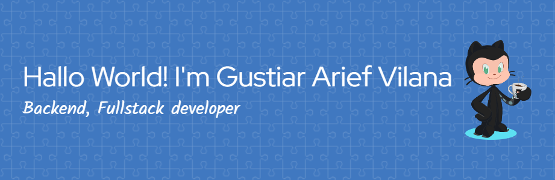

  

  <h2 align="center">Halo! 👋 </h2>

  

    Saya seorang <strong>Web Developer</strong> yang berdomisili di <strong>Sukabumi, Jawa Barat, Indonesia</strong>, dengan minat mendalam dalam 
    <em>Backend Development</em> dan <em>Full Stack Development</em>.
  

---

### 🚀 Saat Ini Saya Sedang

- 📚 Mempelajari lebih dalam: **Cloud Computing, Kafka, CI/CD, dan arsitektur microservices**.

---

### 🌱 Ketertarikan Saya

- ☁️ Eksplorasi bidang: **Cloud Infrastructure, DevOps, Distributed Systems**
- 🤝 Kolaborasi pada: **Proyek open-source, aplikasi web skala besar, dan sistem backend modern**
- 🌐 Berkontribusi dalam: **Komunitas pengembang lokal dan internasional**

---

### 🛠️ Keahlian Teknis

#### 💻 Bahasa Pemrograman

  
  
  
  

#### 📚 Framework & Library

  
  
  
  
  

#### 🧪 Tools & Teknologi Lain

  
  
  
  
  
  
  

---

### 💼 Pengalaman Profesional

- **Backend Developer** | PT Teknologi Indonesia _(2022 - Sekarang)_

  - ✅ Merancang dan mengembangkan API dengan Quarkus dan Spring Boot.
  - ✅ Menerapkan arsitektur microservices dan integrasi Kafka.

- **Full Stack Developer** | CV Inovasi Digital Nusantara _(2018 - 2022)_
  - ✅ Membangun aplikasi web menggunakan Laravel dan React.
  - ✅ Mengelola deployment pipeline dengan GitLab CI/CD dan Docker.

---

<!-- ### 📌 Proyek Pribadi Terpilih

- **Smart Proposal Generator**

  - Aplikasi berbasis web untuk menghasilkan proposal otomatis dalam format PDF dan Word.
  - 🔗 [Lihat Repositori](#)

- **PWA E-Commerce Dashboard**
  - Dashboard progressive web app dengan manajemen inventaris dan notifikasi real-time.
  - 🔗 [Lihat Repositori](#)

--- -->

<!-- ### 🖼️ Showcase & Dokumentasi

  
  

  *Cuplikan proyek, demo video, atau dokumentasi visual yang saya buat.*

--- -->

### 📫 Kontak & Sosial

  
  
  
  

